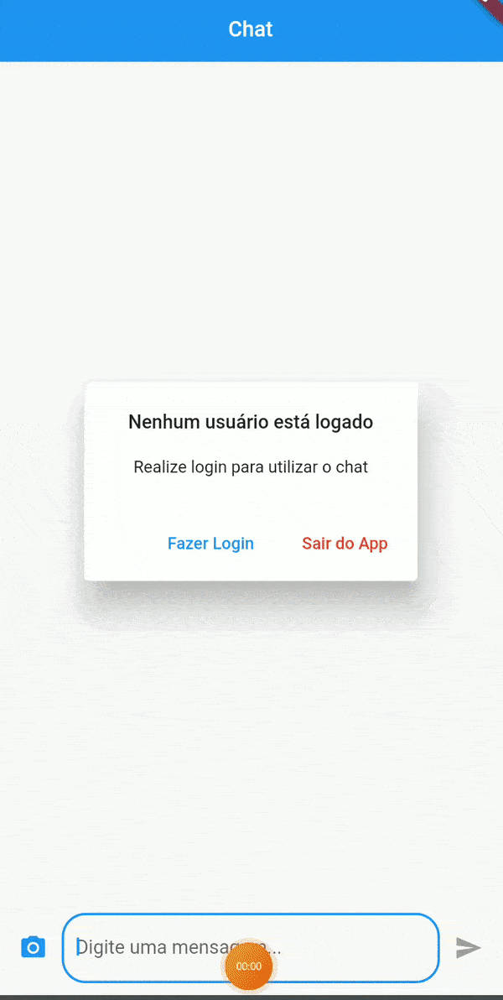

# Chat Messenger App
 Aplicativo de Chat para envio de mensagens de textos e imagens em tempo real utilizando Firebase. O App possibilita o login através da conta Google do usuário. A sala de chat permite o envio e exclusão das mensagens (texto e imagens), além da visualização com zoom das imagens enviadas. Para visualizar as mensagens, o usuário precisa estar logado em sua conta.

***
### Download do Aplicativo (APK)
Faça o download do arquivo APK do app e instale-o em seu smartphone.

  <a href="https://drive.google.com/u/0/uc?id=1QTNGdd9iMifl4u09stDRllAua4BWnhY2&export=download">Download App</a>

 

 
 

## Aprendizado
* Manipulação de *Forms*.
* Utilização de `setState`.
* Utilização do Firebase RealTime.
* Utilização do Firebase Storage.
* Autenticação com Firebase via Google Account.
* Manipulação de matrizes para visualização das imagens com zoom.
